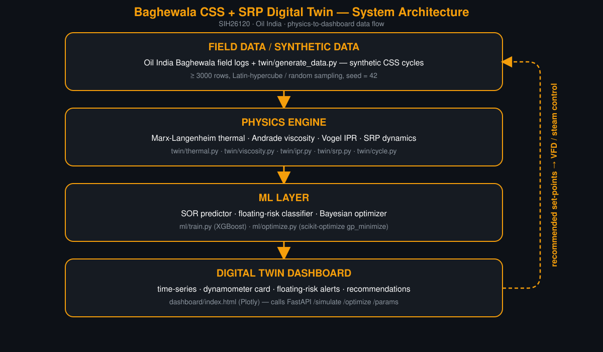

# Baghewala CSS + SRP Digital Twin


Repository visibility is controlled by the team; if you see a 404 on GitHub, ask the
team lead for access.

A physics-informed digital twin that simulates, predicts, and optimizes Cyclic Steam
Stimulation (CSS) and Sucker-Rod Pump (SRP) operations for Oil India's Baghewala
heavy-oil field — turning manual steam/pump tuning into a data-driven Steam-Oil Ratio
(SOR) optimizer with built-in rod-floating risk alerts.

Built for **Smart India Hackathon 2026**, Problem Statement **SIH26120** (Oil India
Limited), by a Chemical Engineering + Software team from **MNIT Jaipur**.

---

## Repository map

```
sih-baghewala/
│
├── twin/            Physics engine — thermal, viscosity, IPR, SRP, CSS cycle simulator
├── ml/              XGBoost SOR surrogate + floating-risk classifier + Bayesian optimizer
├── api/             FastAPI backend (/params, /simulate, /optimize)
├── dashboard/       4-page browser dashboard (edit src/, rebuild with build.js)
├── tests/           pytest checks for the physics engine
├── params/          field_params.json — single source of truth for every physical parameter
├── data/            synthetic CSS cycle datasets (generated by twin/generate_data.py)
│
├── ppt/             SIH pitch deck
│   ├── final/       ★ the deck to submit (STRICT, .pptx + .pdf)
│   ├── archive/     superseded deck versions, kept for reference
│   ├── notes/       deck content, build notes, winning-deck analysis
│   └── ...          build scripts, template, diagram + SVG asset library
│
└── docs/            everything that is read, not run
    ├── PROJECT_LOG.md      project state, decision log, numbers bible, TODO — start here
    ├── SPEC.md             build contract: module signatures, schemas, conventions
    ├── guides/             demo script, glossary, UI brief
    ├── research/           sourced field facts, references, competitive landscape, deep dives
    ├── model-improvement/  physics / ML / economics improvement plans + Tier-1 progress log
    ├── reviews/            content, docs, UI and integration reviews
    └── study/              team study guide, viva prep, Hinglish study pack
```

**New here?** Read [`docs/PROJECT_LOG.md`](docs/PROJECT_LOG.md) first, then
[`docs/SPEC.md`](docs/SPEC.md). Each of `docs/` and `ppt/` has its own README index.

---

## Architecture

The twin is a four-stage pipeline: field/synthetic data feeds a physics engine, whose
outputs train ML models, which drive a dashboard that in turn recommends set-points
back to the field.



1. **Field Data / Synthetic Data** — Oil India Baghewala field parameters
   (`params/field_params.json`) plus `twin/generate_data.py`, which produces ≥3000
   synthetic CSS cycles (Latin-hypercube sampling, seed 42).
2. **Physics Engine** (`twin/`) — deterministic, no-network simulation: a
   Marx-Langenheim heat balance feeding an exact-cylinder Boberg-Lantz heat-loss model
   with a **computed** δ, Andrade/Walther viscosity, a Vogel-type IPR with composite
   steam uplift, and an SRP model where pump capacity is compared against **liquid**
   rate with floating-index diagnostics — orchestrated by a CSS cycle simulator. Rev
   12 (physics wave 4) adds: **water cut as a state** (condensate flowback decaying
   into a formation-water floor, rather than a constant 85%) so the produced stream
   starts water-continuous and turns oil-continuous late in the cycle; the
   **Pal–Rhodes W/O emulsion law capped at 10×** (algebraically Brinkman below 60%
   water, the cap is the only thing that changes the physics near inversion); an
   **injection-pressure lever** (IAPWS-IF97 steam state set by the wellhead pressure,
   with the near-well recharge capped at the sandface pressure) and a **stroke-length
   lever** (API 64–144 in, checked against a polished-rod-load cap); and the
   **float-onset produce-end rule** — the cycle ends on a rate cutoff (economic
   backstop) **or** on 3 consecutive days of floating-index alarm, whichever the
   operator would actually act on first — plus `AOF_REF_M3D` retuned to the field's
   15–40 bbl/d peak band. Economics run on an **incremental** basis (stimulated cycle
   minus the same well produced cold over the same calendar window, plus daily opex
   and pumping power); gross SOR stays the headline metric, matching
   literature/CalGEM convention, while ₹ decisions use the incremental margin. **Rev
   13 (physics wave 5)** makes the operator's **response to rod float a control**,
   `css.float_policy` ∈ {`pull`, `vfd_hold`, `vfd_then_pull`, `none`} — a VFD can hold
   the floating index at 0.6 down to a 2-spm floor instead of pulling the well the
   moment it floats — and applies the SAME policy to the baseline, the recommendation
   *and* the cold counterfactual (which is shut in, not credited as pumpable, once it
   floats under a policy). It also smooths the inversion cliff (a 0.075 water-cut
   band), gates injectivity (≥400 kPa sandface margin over reservoir pressure), and
   adds a net-of-royalty-and-cess price deck. Calibrated as physics rev 13 (see Status
   below); **no calibration knob moved** — this wave only reframes what the
   operator does after float and how the counterfactual/decks are read.
3. **ML Layer** (`ml/`) — **honest role, not a second optimiser.** The exhaustive
   6-lever × policy physics grid (`ml/recommend_physics.py`'s `best_settings_
   physics_5d`) is the decision engine (40,194 feasible points per policy after the
   injectivity gate, 4 policies, ~172 s, every point true-physics-verified). The
   XGBoost surrogates (oil, gross/incremental/net-cash margin, float-risk) exist only
   as a fast emulator for the dashboard's live what-if sliders and the UQ/scheduler
   bake, re-verified against the true twin at every reported point. Running the
   Bayesian optimizer (`ml/optimize.py`) over the surrogate lands **~24% below** the
   physics-grid optimum (+₹11,635/d vs +₹15,396/d FY25 — a 60-call search under-
   resolves the steam/pressure dimensions, the grid's own weakest economic levers);
   it is reported as a cross-check, never as an alternative recommendation. The float
   classifier (`float_premature_pull`, 41% positive, AUC 0.999) is informational only
   as of rev 13 — it is **not** a search constraint (the injectivity gate, a real
   physical limit, replaced the old soft float-risk penalty).
4. **Digital Twin Dashboard** (`dashboard/`) — overview, twin console, optimizer,
   methodology and field-view (multi-well scheduler) pages, backed by the FastAPI
   service in `api/` (falls back to baked physics data when the API is not running).
5. **Computed + measured dynamometer cards** (`twin/dyno.py`, `ml/dyno_classifier.py`)
   — surface and pump cards from a Gibbs (1963) rod wave-equation finite-difference
   solve, so the twin console can show a real card shape at any day of a cycle,
   including carrier-bar separation (rod float). A `RandomForestClassifier` trained
   on 3,200 synthetic cards (`heavy_oil_viscous`, `fluid_pound`, `full_pump`,
   `gas_interference`, `rod_float`) reads a **measured** surface card the field
   uploads — 94.8% hold-out accuracy — with a domain-shift caveat repeated on every
   call: it has never seen a real Baghewala card and is a first read to confirm with
   a pump specialist, not field-validated.
6. **Calibration loop** (`twin/calibrate.py`, `ml/recommend_physics.py`) — fits the
   twin's biggest uncertain constants (`formation_water_cut`, `AOF_REF_M3D`,
   `thickness_m`; `bl_delta_factor` is sourced/fixed, not fitted) to observed
   per-well CSS cycles (`scipy.optimize.least_squares`, bounded, deterministic), then
   re-recommends set-points directly against the recalibrated **physics** (not the
   stale default-physics-trained ML surrogate) — the "ingest → recalibrate →
   re-recommend" step that turns the simulator into a twin. `POST /calibrate`
   and `GET /calibrate/demo` expose it over the API; see `ml/README.md`.
7. **Field-level scheduler** (`ml/schedule.py`) — PS SIH26120 asks for optimisation
   across the field, not one well: ~33 Baghewala wells share **one** steam generator.
   The scheduler physics-optimises each well's job, then chooses which wells get
   steam next and in what order (bitmask-exact search over well subsets, ERD order
   within a subset) to maximise the field's total incremental ₹/day. On a 12-well
   synthetic demo, every well run **VFD-hold** (rev 13's recommended policy), the
   naive fixed-job policy is **+₹72,320/d** field-wide (rev 12, still pulling on
   float, was a field-wide **loss** of −₹13.3k/d — the policy switch alone is the
   difference); per-well physics optimisation (greedy) adds +₹32,083/d
   (+₹104,403/d total), and exact scheduling (serving 10 of 12 wells, declining the 2
   lowest-value ones) adds a further +₹5,396/d (+₹109,799/d total). `POST
   /api/schedule`; dashboard "Model basis" → field view.

Recommended set-points from the optimizer are the feedback loop back to the field
(VFD speed / steam controller set-points) — closing the loop from data to decision.

---

## Status (27 Sep 2026 — rev 13)

Physics is **rev 13** (physics wave 5, 27 Sep). It answers the technical re-score's
top finding: the rev-12 headline gain (+₹9,574/d) came from the **pull rule** ending
the baseline on the float alarm while it still made real oil — the twin's own
VFD-slowing mode erased that gain entirely. Rev 13 makes the operator's **response
to rod float a control** (`css.float_policy` ∈ `pull` / **`vfd_hold`** /
`vfd_then_pull` / `none`), applies the SAME policy to the baseline, the
recommendation, and the cold counterfactual (which is **shut in**, not credited as
pumpable, once it floats under a policy), smooths the inversion cliff, gates
injectivity, and adds a net-of-royalty-and-cess price deck. **No calibration knob
moved** — only the diesel discount base (0.30 → 0.15, an economics input, moved to
the mid of its own range on the coordinator's instruction). **263 tests passing,
2 xfailed** (soak — no defensible interior optimum; the steam optimum at the
mid-range diesel price sits below the BGW-8 slug range — both documented findings,
not failures); the rev-12 cold-well xfail is **un-xfailed** (the counterfactual now
obeys the policy). See `docs/model-improvement/TIER1_PROGRESS_LOG.md` §12.

**Recommended policy: VFD-hold** — let the VFD slow the pump to hold the floating
index at 0.6 (floor 2 spm), pull only after 3 alarm days at the floor. The default
`css.float_policy` param stays `pull` (the benchmark calibration's own operation —
switching the default would be calibration-by-respecification, TIER1 §12.2); the
*recommendation* is `vfd_hold` regardless.

| | Baseline (b), VFD-hold — 1,300 t/10 d/91 kgf/cm²/86-in/5 spm/cutoff 1.3 | **Recommendation, VFD-hold — 1,000 t/10 d/89 kgf/cm²/64-in/start 4.5 spm/cutoff 0.60 backstop** |
|---|---|---|
| SOR | 3.29 | **2.83** |
| oil m³ · produce days (window) | 395 · 199 (227) | 353 · 196 (220) |
| cycle ended by | float pull at the 2-spm floor | float pull at the 2-spm floor |
| net cash ₹/cycle-day — FY25 / $65 / net-of-levies | +12,064 / −582 / −14,193 | **+15,396 / +3,738 / −8,811** |

**The gain depends on what the baseline operator does** — quoted per cycle-day, net
cash, FY25 / $65 / net-of-levies:

| If the baseline… | Best-within-that-policy recommendation gains |
|---|---|
| **VFD-holds too** (fair, same-policy comparison) | **+₹3,332 / +4,319 / +5,382** — a modest, operational gain (~5% of the recommendation's own gross revenue/day); decomposes stroke 57% / cutoff 30% / steam 11% |
| **pulls at the first alarm** (rev-12 operation) | +₹12,917 / +14,694 / +16,606 — **68% of this is the policy switch alone**, not the set-point; this is the same structure as the old (retired) "+₹9,574/d" headline |
| **does nothing about float** (rods run floating to the rate cutoff) | **+₹2,622 / +3,484 / +4,413** — the canonical recommendation gains money by reducing oil volume and steam (we do not price rod failures: VFD-hold holds FI at 0.6 for ~60 days, damage index ~5× the pull policy's, entirely unpriced); a different float-safe plan (not the recommendation) would show −₹3,865 |

SOR moves 3.29 → 2.83 (−14%) under the same policy; 4.35 → 2.83 against a *pulling*
baseline (the rev-12-style comparison). Under VFD-hold, every case (reference,
baseline, recommendation) is held at the float alarm line for 58–62 days — the
graded rod-damage index (Σ FI³) runs ~5× the `pull` policy's — the price of the
extra oil, and it is **unpriced in ₹** (no rod-string failure/workover cost is
modelled).

Reference cycle 1,500 t/7 d/1.2 m³/d/5 spm/86 in/91 kgf/cm² (shipped default `pull`,
unchanged by rev 13): SOR 4.50 gross. UQ (1,500 draws, seed 42, all 3 price decks):
**P(injectable) = 1.000** everywhere (the canonical 89 kgf/cm² clears the 400 kPa
gate in the whole box). Same-policy P(rec > baseline), VFD-hold: **96 % against a
baseline whose 1.3 m³/d cutoff we chose; 84 % (median ₹2.5k/day) with the same
0.6 backstop; ≈ ₹0 if the VFD can run below 2 spm, as our own cold well does —
OIL's VFD minimum speed is the one datum that decides the gain.** (raw draws:
0.965 / 0.992 / 0.999 FY25 / $65 / net-of-levies); if the baseline pulls,
0.991–1.000; if the baseline does nothing about float, only **0.16–0.25**.
Same-policy gain (VFD-hold)
p10/p50/p90: **+₹2,175 / +12,101 / +161,014** FY25 — right-skewed (the point
estimate sits toward the low side; the p90 tail is the baseline's own fragility, a
cycle that ends within days of its peak). The recommendation's own net cash/day
(median across the same draws): +₹1,132 (FY25) / −₹6,940 ($65) / −₹15,621
(net-of-levies) — **P(net cash > 0): 0.54 / 0.25 / 0.03 vs a shut-in cold well;
0.21 / 0.07 / 0.003 vs a pumpable (0.53 spm) cold well.** Top
drivers on the recommendation: μ_ref, cold-well skin, oil price, formation water
cut. **This project never claims an absolute per-cycle CO₂ reduction** — the
recommended cycle burns 23% less steam for 11% less oil (353 vs 395 m³) under
VFD-hold; steam per m³ falls 3.29 → 2.83, so SOR and CO₂ per m³ oil fall, but
that is a same-policy comparison, not a law of the physics.

### Coverage of the PS's controls

| Control | Status |
|---|---|
| Steam volume | optimised |
| Injection (wellhead) pressure | optimised |
| Rate cutoff | optimised, as an economic backstop |
| Stroke length | optimised |
| SPM | optimised |
| Soak duration | modelled, held fixed (no defensible interior optimum) |
| VFD | **rev 13: a real operating-policy control** — `pull` / `vfd_hold` / `vfd_then_pull` / `none`, an optimiser dimension in its own right (holds the floating index at 0.6 down to a 2-spm floor instead of pulling on the alarm; recommended: `vfd_hold`); intra-stroke speed shaping is still out of scope |

**Real-data benchmark.** `docs/research/CALGEM_CSS_BENCHMARK_2026-09-26.md` — a
shallow, predominantly steamflood field (Kern River) with a cyclic-steam subset;
5,771 CalGEM/California wells, 2018–21, field-level SOR band only: official 2021
field SOR band **3.47–8.24**; the model's gross SOR (4.50 at the reference) sits
inside it, closest to Kern River's own field average. Per-cycle real oil (needed for
a true per-cycle SOR/uplift check) was not obtainable from any public mirror this
session — it needs a human with a browser at
`wellstar-public.conservation.ca.gov` (`docs/research/OIL_DATA_REQUEST.md`).

**Honest limits.**
- All 3,000+ training cycles are physics-simulated — **zero real Baghewala cycle
  records** back any number here.
- **Rod damage is unpriced.** VFD-hold buys real oil by holding the floating index
  at the 0.6 limit for ~60 days a cycle (graded damage index ~5× the `pull` policy);
  no rod-string failure or workover cost is modelled — the recommendation's own
  gain against a do-nothing baseline is **+₹2,622/d** (FY25), a different float-safe plan
  would show −₹3,865/d (not the canonical recommendation).
- **The model's cold, unstimulated well is shut in**, not pumped, under every float
  policy (FI 1.0, 189 kN at the assumed unit's 2-spm floor) — every absolute
  incremental ₹ figure here is therefore an **upper bound**; the field did produce
  these wells cold, so the `pumpable` counterfactual (~₹11.4k/d lower) is the more
  field-consistent reading, and is reported alongside it.
- **Net of royalty + OID cess (₹3,600/bbl, ~35% levies on OIL's own FY25 basis),
  every feasible grid point is negative** — the recommendation's edge over the
  baseline still grows on this deck (it saves steam), but "is CSS profitable" is
  answered by OIL's own price/levy deck, not by this repo's assumptions.
- **The best slug size drops below what BGW-8 used** at the mid-range (0.15) diesel
  discount — the gross-margin optimum is ~750 t vs BGW-8's 1,040–1,560 t (a disclosed
  strict xfail, `test_steam_optimum_at_the_mid_range_diesel_price_is_within_bgw8`);
  read as revealed preference, OIL's own slug size argues its steam is cheaper than
  the mid-range assumed here.
- Daily opex (₹5,000/d `[ASSUMPTION]`) and the $10/bbl heavy-oil discount are
  unsourced judgement calls the ₹ sign depends on; the diesel discount base moved to
  the mid (0.15) of its own U[0, 0.30] range this rev, also unsourced.
- The soak-optimum test is a disclosed xfail: Boberg–Lantz has no soak benefit beyond
  conduction in this model, so "the twin recommends N days of soak" is never claimed
  — soak is held at the 10-day published-practice value.
- The rod-float thesis, the SPM/stroke recommendation and the float-onset rule all
  ride on the water-cut-vs-time profile and the emulsion inversion point, neither of
  which is measured at Baghewala — both are `[ASSUMPTION]`.
- No real production history: the recommendation's value depends on OIL's actual
  current SPM, stroke and float-response practice (slow vs. pull), none of which are
  known — `docs/research/OIL_DATA_REQUEST.md` asks for it directly.

---

## Quickstart

```bash
# 1. Install dependencies (or `pip install -r requirements.lock.txt` for the exact
#    tested set)
pip install -r requirements.txt

# 2. Generate synthetic CSS cycle data (deterministic, seed=42)
python -m twin.generate_data

# 3. Train the ML models (oil + margin/cycle-day regressors + floating classifier)
python ml/train.py

# 4. Start the API (FastAPI, http://localhost:8000)
# (runs in the foreground; open a second terminal for the next steps, or
# add `&`/use Ctrl+C)
python -m api.main

# 5. Open the dashboard
python -m webbrowser dashboard/index.html

# Run the physics tests
python -m pytest -q

# Calibration loop demo: fit the twin to a synthetic pseudo-real cycle
# dataset and show recovered-vs-truth + before/after recommendation
python -m twin.generate_pseudo_real
```

Dev alternative for step 4 (auto-reloads on code changes): `uvicorn api.main:app --reload`.

Run steps 2 → 3 → 4 in order: models need the data, and the API needs the models.
The dashboard is generated — edit `dashboard/src/` and rebuild with
`node dashboard/build.js` (see [`dashboard/README.md`](dashboard/README.md)).

The Quickstart regenerates `data/synthetic_cycles.csv` and `ml/models/*` — both are
committed so the dashboard's baked numbers stay reproducible without a running API;
run `git diff --stat` afterwards and discard those files if you don't intend to
re-bake them.

**Optional / regenerate baked artefacts**
```bash
# Regenerates ml/models/uq_summary.json + ml/models/uq_samples.csv (paired
# Monte Carlo bands shown on the dashboard's methodology/UQ views)
python ml/uq.py

# Regenerates ml/models/dyno_cards.json (8 baked surface+downhole dynamometer
# cards -- baseline/recommendation x 4 scenarios); dashboard/src/dyno-data.js
# must then be re-exported from it by hand (see dashboard/README.md
# "Re-baking") and `node dashboard/build.js` re-run
python -m twin.dyno --bake ml/models/dyno_cards.json
```

---

## Run as one service / deploy

```bash
uvicorn api.main:app --reload        # API + dashboard at http://127.0.0.1:8000 (docs at /docs)
docker build -t sih-baghewala . && docker run -p 8000:8000 sih-baghewala
```

**Live demo:** <https://baghewala-digital-twin.onrender.com> (Render free tier; API docs at
[`/docs`](https://baghewala-digital-twin.onrender.com/docs), health at
[`/api/health`](https://baghewala-digital-twin.onrender.com/api/health)).

Served by FastAPI the dashboard switches to **live physics** automatically (status chip
"Live API"); opened from `file://` it falls back to baked data. Render / Railway / Fly /
VPS instructions: [`docs/DEPLOY.md`](docs/DEPLOY.md).

---

## Team & problem statement

| | |
|---|---|
| **Problem statement** | SIH26120 |
| **Title** | Digital Twin for Well-to-Surface Optimization of Cyclic Steam Stimulation and Sucker Rod Pump Operations |
| **Organization** | Oil India Limited |
| **Field** | Baghewala, Bikaner-Nagaur basin, Rajasthan (17–19° API per PS; field literature reports 14–17° API, 8,000–15,000 cP @ 50°C — India's first CSS site, well BGW-8, Dec 2018) |
| **Team** | Chemical Engineering + Software, MNIT Jaipur |
| **Event** | Smart India Hackathon 2026 |

---

## License

Released under the MIT License. Physics models are implemented from public,
peer-reviewed references (Marx & Langenheim 1959; Andrade 1934 / ASTM D341; Vogel
1968) — see `docs/research/` for citations. Field parameter values in
`params/field_params.json` are calibrated to Oil India / SPE-published Baghewala
data (see `docs/research/baghewala_facts.md` for sources); a small number of fields
with no public source (e.g. net pay thickness) remain typical-industry placeholders,
flagged as such in `docs/research/`.
